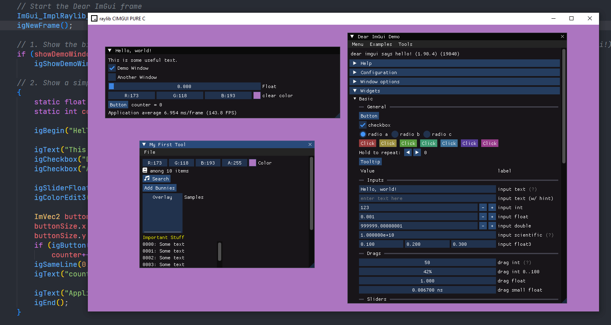

# raylib cimgui

A pure C raylib backend for the immediate mode gui [Dear ImGui](https://github.com/ocornut/imgui), on top of [cimgui](https://github.com/cimgui/cimgui).

This Dear ImGui backend is heavily adapted from the excellent C++ raylib's Dear ImGui backend [raylib-extras/rlImGui](https://github.com/raylib-extras/rlImGui).



## Building
- cimgui can be linked both dynamically or statically to your raylib project.
    - Statically linking to cimgui requires linking `-lstdc++`.

- Clone or install raylib somewhere.

- Clone cimgui somewhere:
```
    git clone --recursive https://github.com/cimgui/cimgui.git
    git submodule update --init --recursive
```

- Include and link cimgui.
- Build `rlcimgui.c` alongside your project.

### Building in a raylib project
Check the included example Makefile in the examples folder. 

```
CIMGUI_PATH = /path/to/cimgui
#...
INCLUDE_PATHS += -I$(CIMGUI_PATH)
#...
LDFLAGS +=  -L$(CIMGUI_PATH)
#...
LDLIBS += -lcimgui -lstdc++

# Build rlcimgui.c alongside the project
PROJECT_SOURCE_FILES ?= \
    ../rlcimgui.c \
    raylib_cimgui_demo.c

#...

# Build cimgui and Dear ImGui
$(CIMGUI_PATH)/libcimgui.a:
	$(MAKE) -C $(CIMGUI_PATH) CXXFLAGS="-O1 -fno-exceptions -fno-rtti -std=c++11 -DIMGUI_DISABLE_OBSOLETE_KEYIO=1" static
```

Acknowledgments to [Lucrecious](https://github.com/Lucrecious) for some of the Makefile tips. Check his "Makefile.alternative" in the examples folder (requires adjustment, since Lucrecious' file is aimed at using [rlImGui](https://github.com/raylib-extras/rlImGui)).

## Usage
See the included examples in the "examples" folder.

### Example
To build and run the example, edit the paths in Makefile (CIMGUI_PATH and RAYLIB_PATH), then:

```
cd examples
make
./raylib_cimgui_demo.exe
```

## Font Awesome Icons

Inspired by rlImGui, support for Font Awesome 6 https://fontawesome.com/ is also built into raylib cimgui and enabled by default. You can simply `#include "extras/IconsFontAwesome6.h"` to use the ICON_FA macros for any icon in the free set.

The example `raylib_cimgui_demo.c` already includes usage for Font Awesome.

If you wish to disable font awesome support you can `#define NO_FONT_AWESOME`.